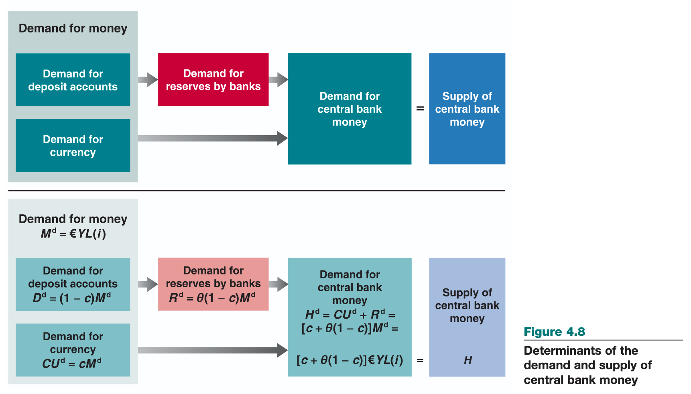

# money market

## demand

* asset types
    * money
        * currency: coins, bills
        * deposit accounts: bank deposits
    * bonds: interest rate, not used for transactions
* money vs bonds dependent on...
    * level of transactions: need money on hand to avoid having to sell bonds, dependent on spending per month etc
    * interest rate on bonds: holding wealth in bonds is for interest, hassle of managing bonds is dependent on rate
* money market funds pool funds of many people to buy bonds
* terms
    * income: earning from work + interest, dividends; flow over time
    * saving: after-tax income not spent
    * wealth: value of all financial assets minus financial liabilities
    * investment: purchase of new capital goods

## derivation

* $M^d$: amount of money people want to hold
* if nominal income increase, transactions increase proportional, $M^d$ increase proportional
* $M^d = \$YL(i)$
* based on some function of interest rate, $L(i)$
* $M^d$ has negative relationship with $i$

## determining interest rate

* focus on supply of money and equilibrium
* in real world, two types of money: deposit accounts supplied by banks, currency supplied by central bank
* assume deposit accounts do not exist, only money is currency

* suppose central bank decides to supply money equal to $M$, thus $M^s = M$, $s$ for supply
* equilibrium requires money supply equals demand, that $M^s = M^d$
    * so $\text{Money supply} = \text{Money demand}$ and $M^s = \$YL(i)$
    * shows that $i$ must be such that for given income $\$Y$ people must be willing to hold money equal to existing money supply $M^s$; called the $LM$ relationship
    * i.e. increase to supply of money by central bank leads to decrease in interest rate
        * decrease in interest rate leads to increased demand for money, so it equals increased money supply

## open market operations

* central banks change suptply of money by buying or selling bonds
* central banks wants increase, buys bond and pays for them by creating money; if wants to decrease, sells bonds and removes from circulation money in exchange for bonds
    * called open market operations as they happen in 'open market' for bonds
    * expansionary open market operation -> expands supply of money
    * contractionary open market operation -> contracts supply of money

## bond prices and yields

* suppose one-year bonds with payment of $\$100$ and some price $\$P_b$; interest rate given as $i = \frac{\$100 - \$P_B}{\$P_B}$
* price today from one-year bond paying $\$100$ year from today is $\$P_B = \frac{\$100}{1 + i}$ 
* central bank buys bonds -> demand for bonds goes up -> price increases -> interest rate goes down
* central bank sells bonds -> demand for bonds goes down -> price decreases -> interest rate goes up

## liquidity trap

* assume central bank could always affect interest rate by changing money supply
* however, interest rate cannot fall below zero
    * as interest rate decreases, people want to hold more money + less bonds
    * as interest rate becomes zero, people want to hold money equal to $OB$, i.e. right when it hit $0\%$

## adding deposit accounts

### assets/liabilities

* central bank
    * assets: bonds
    * liabilities: central bank money (reserves + currency)
* banks
    * assets: reserves, loans, bonds
    * liabilities: deposit accounts

### cont

* up to this point, assuming only currency supplied by central banks
* banks keep as reserves some funds they receive
    * 1. on given day some depositors withdraw, other deposit cash; no reason for inflows and outflows to be equal
    * 2. on given day, people with accounts write checks to other people with accounts; what bank owes to other banks can be larger or smaller than what is owed to it
    * 3. there are certain reserve requirements applied in areas (europe in this case, with a reserve ratio of 2% on certain deposit types
* loans represent most of banks' non-reserve assets, bonds account for the rest
    * bonds/loans are approximately equivalent in the model
    * assume only reserves and bonds as assets
* demand for money
    * 
* what determines the demand for deposit accounts vs currency?
    * in the equations, the $c$ vs $(1 - c)$ factors, where $c$ is towards demand for currency
* what determines the demand for reserves by banks?
    * based on the amount required by the country, e.g. 2%, and $(1 - c)$, the demand for deposit accounts
* what determines the demand for central bank money?
    * based on a negative relationship with a function $L$ of interest $i$
* how does the condition that demand/supply of central money be equal determine interest rate
    * the demand is through $M_d = \$YL(i)$, so if $M_d$ and $Y$ are set, $i$ has to follow through $L(i)$
    