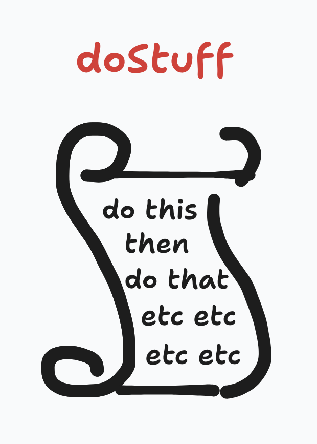
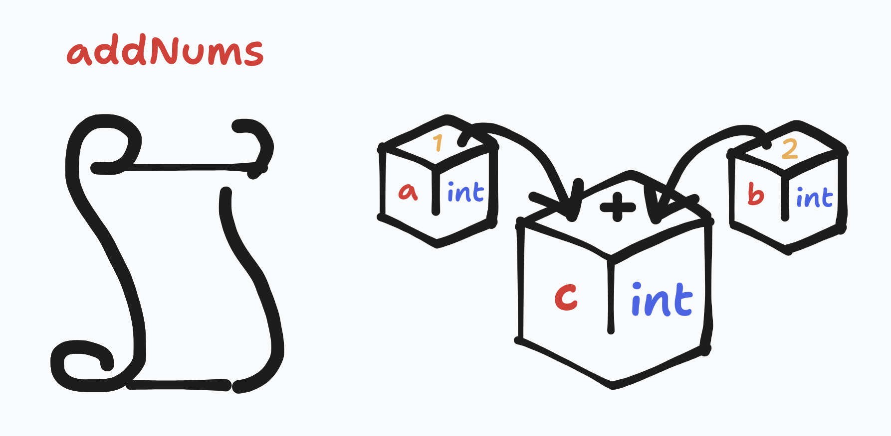
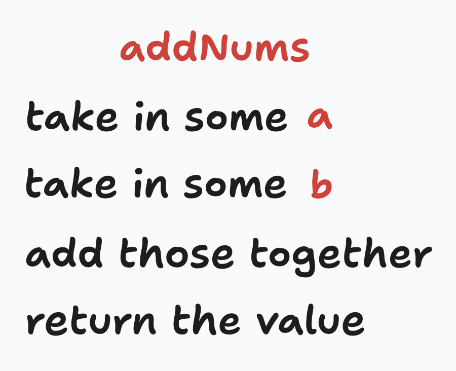
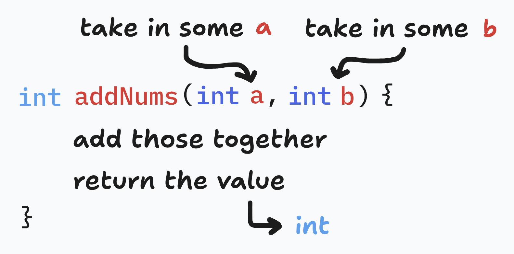
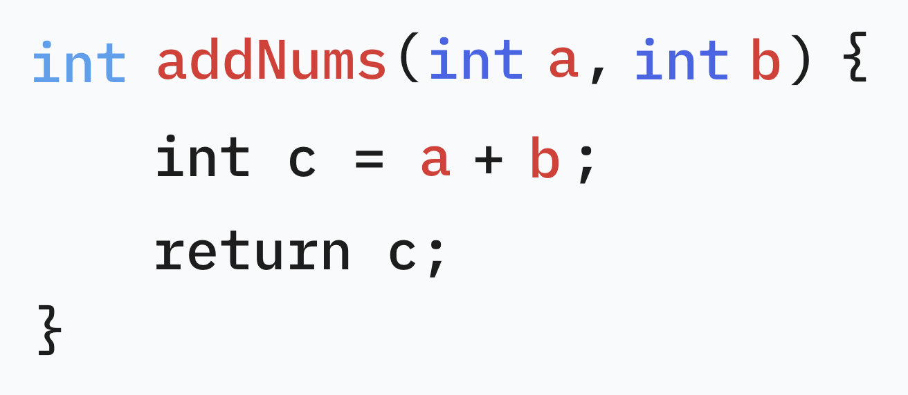
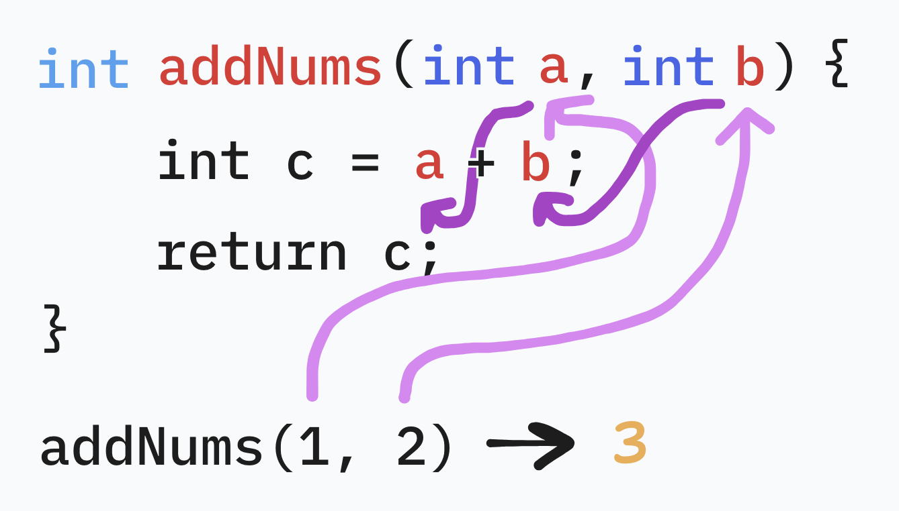

# functions

Functions are like scrolls of instructions that can be 'called' later.

---

Taking the example in the [variables](variables) section, let's replicate it as a function.

Just in English, we can list out how we want the function to work.

For the first two lines, we add these as part of the function declaration.
We also have to specify the return type for the function.

Now, we can translate the inside using basic variable statements. `return` is a special keyword for functions to 'give back' a value.

Calling the function is done with parentheses, putting the supplied values inside.

