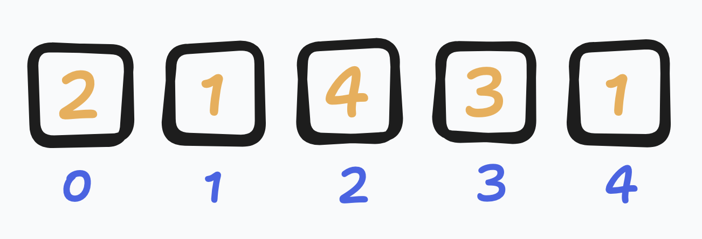
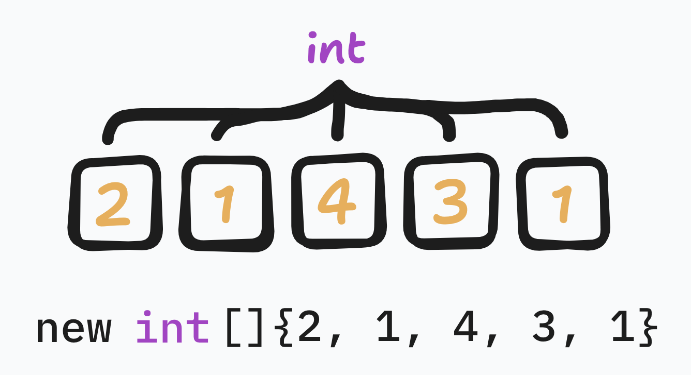
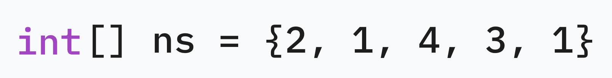
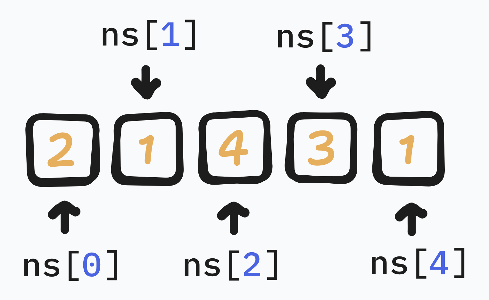
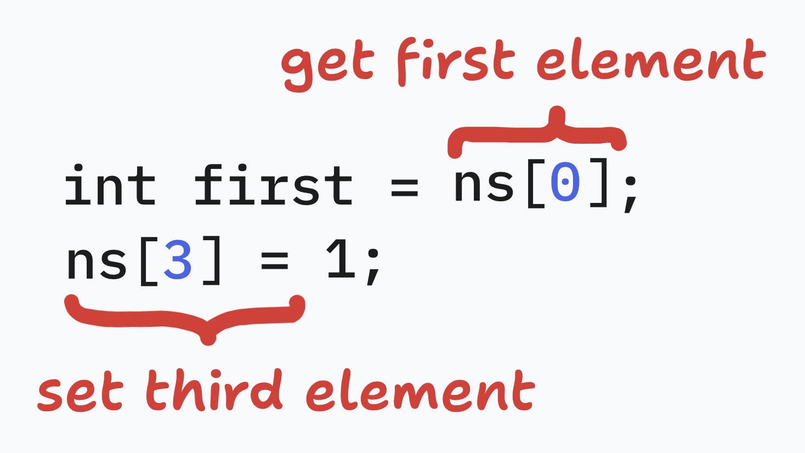

# lists

Lists are ordered sets of elements.
They can be indexed to get the element at a certain position, starting at `0`.

---

Lists need to have a defined type for their elements.

The variable type is `<type>[]`, though we can use shorthand on the right side.

We can access elements of the list using indexing with `[]`.

These elements act like normal variables, and we can do similar operations with them.

