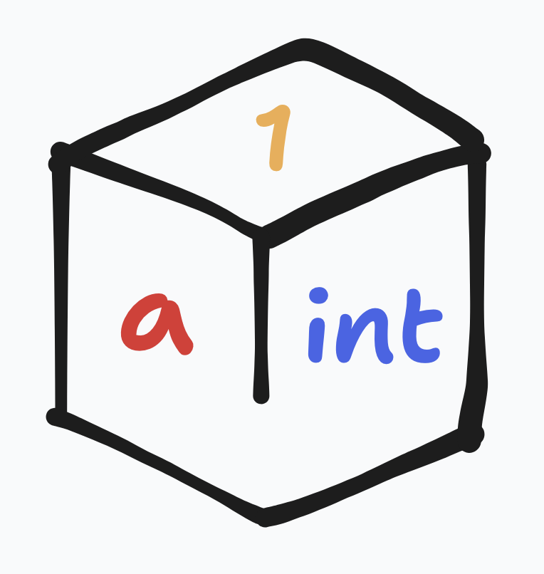
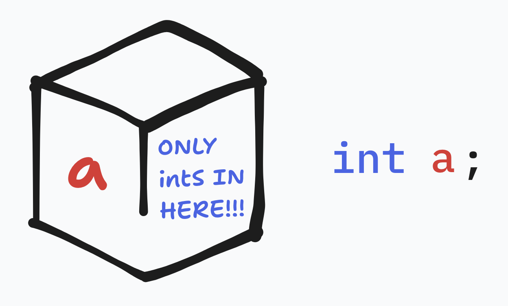
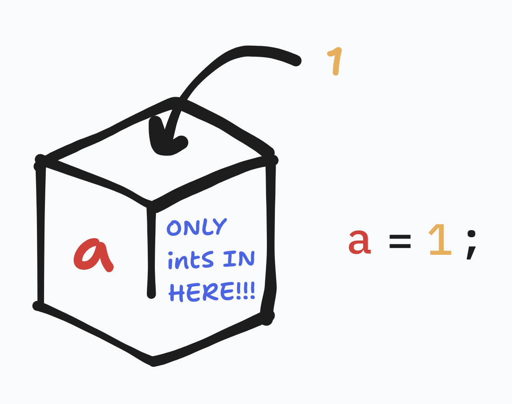
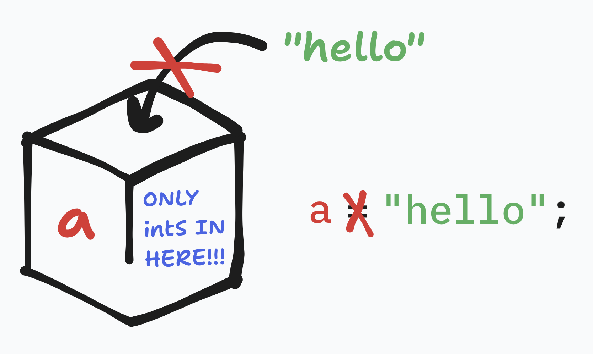
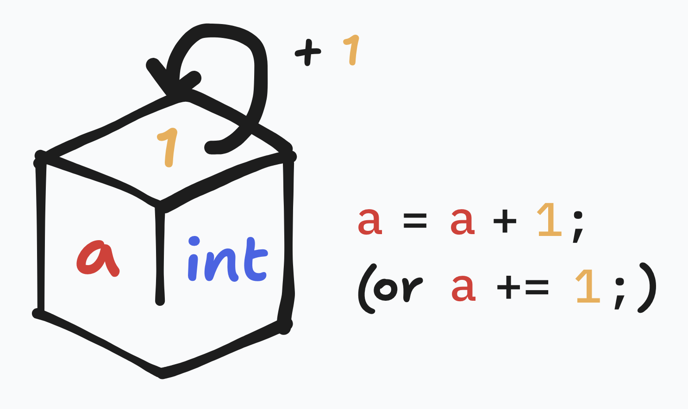
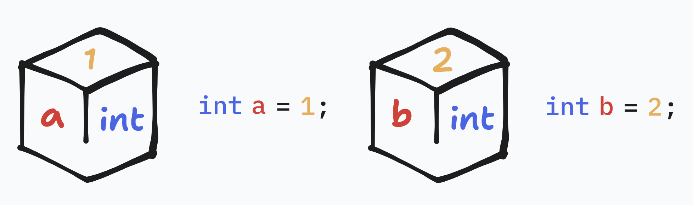
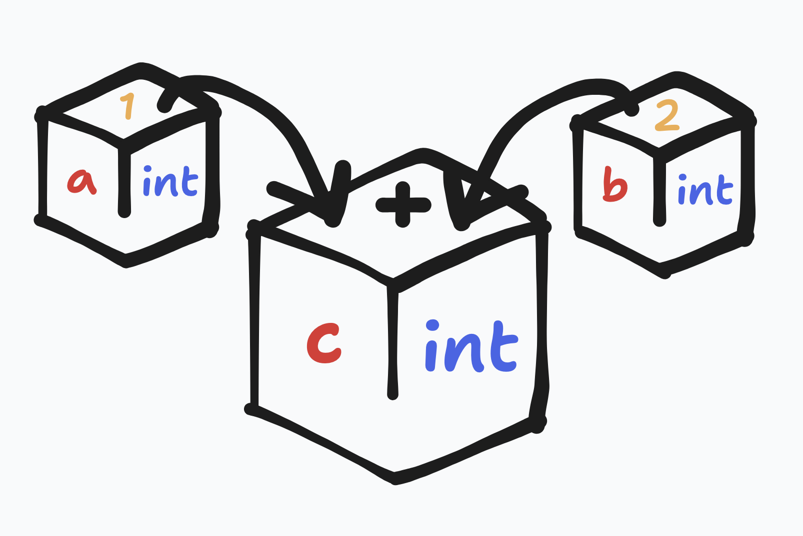
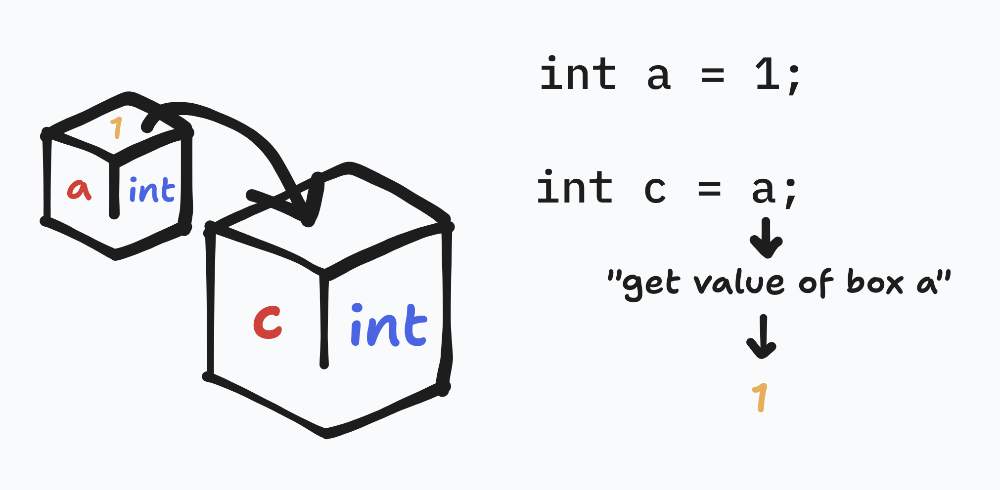
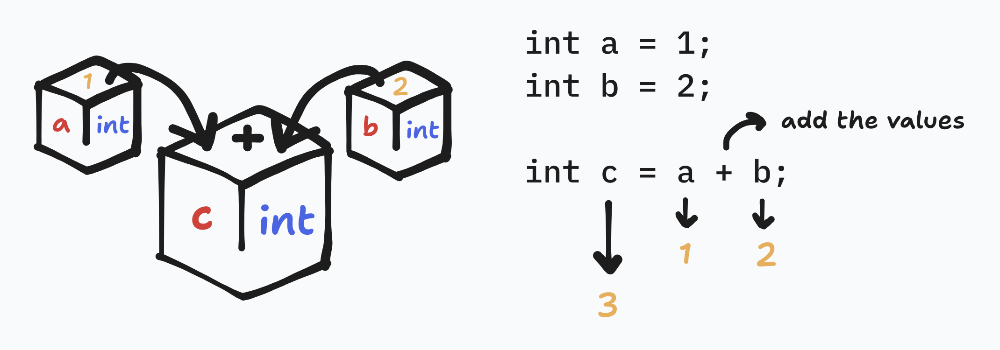

# variables

Variables are like boxes. They have labels and hold values.

---

Create a variable by 'defining' it. We need to specify what kinds of values can go into it.

Set its value.

We can only set a variable to a value that it allows.

We can also update variables. Here, it gets incremented by one.

---

Now, imagine we have two variables. (`type name = value;` is shorthand).

The variable `c` should be the sum of `a` and `b`.

Let's first try just setting `c` to `a`.

Then, we also add `+` and `b` to get the correct value.

