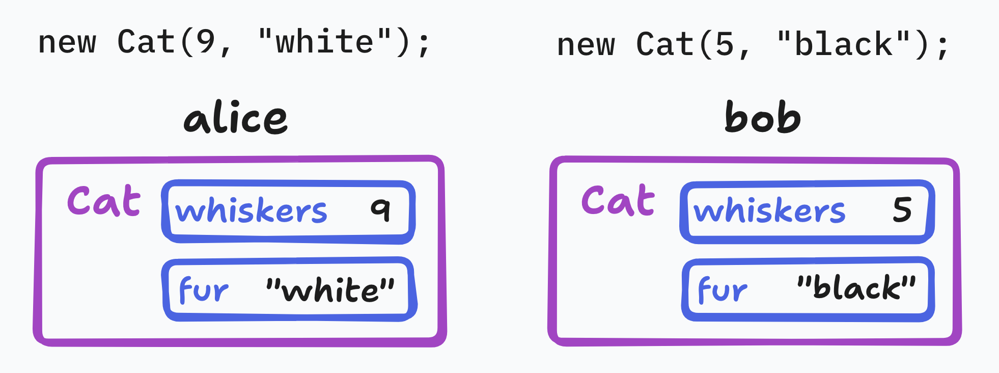
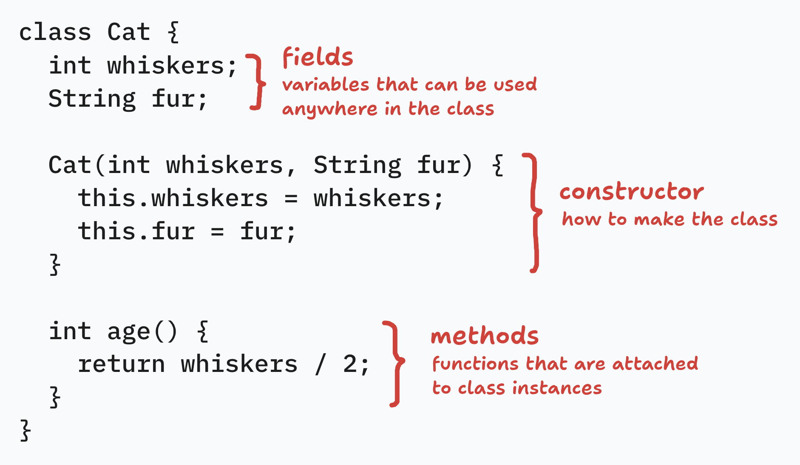
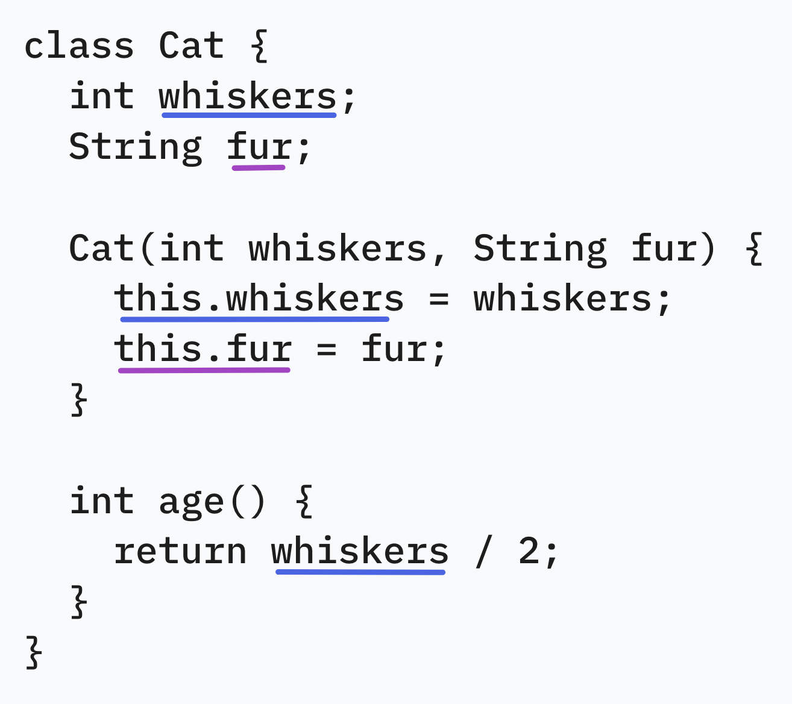
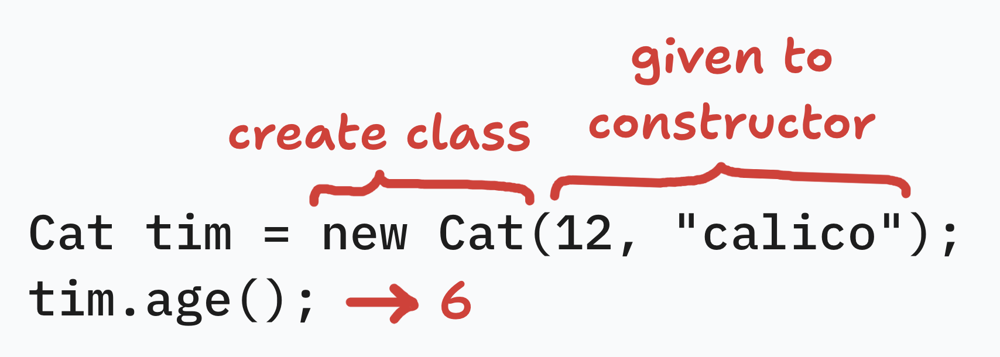
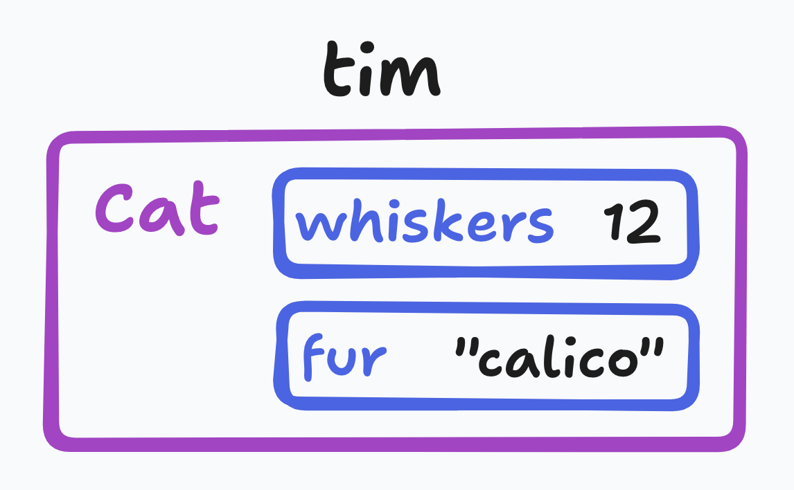

# classes

Classes model things that hold values and have actions.

---

We can define a `Cat` class using the `class` keyword.

Note the fields that are declared and used (sometimes using `this`).

---

An instance of this class can be created.

`tim` holds an instance of `Cat` that has the following values.

