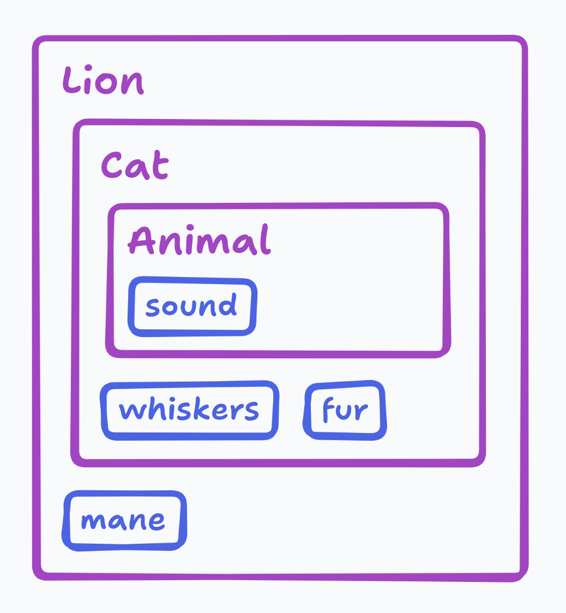
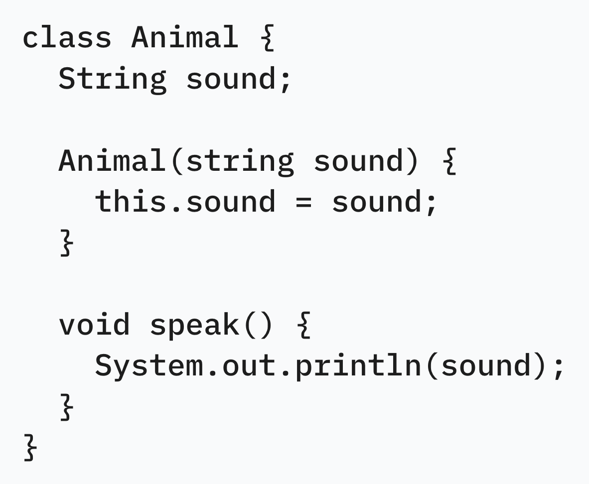
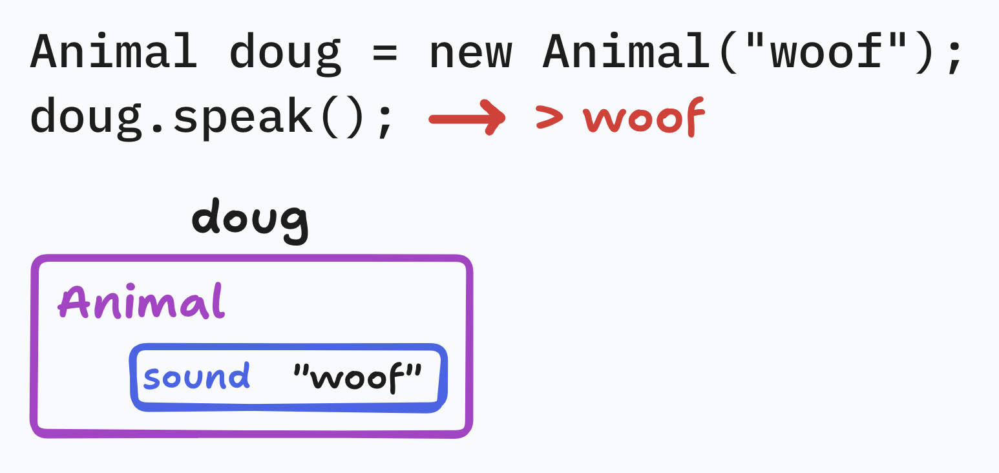
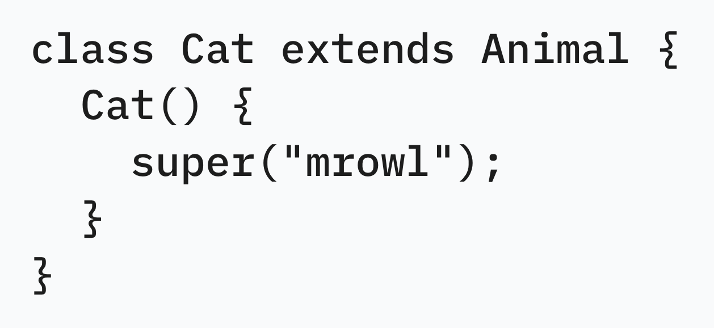
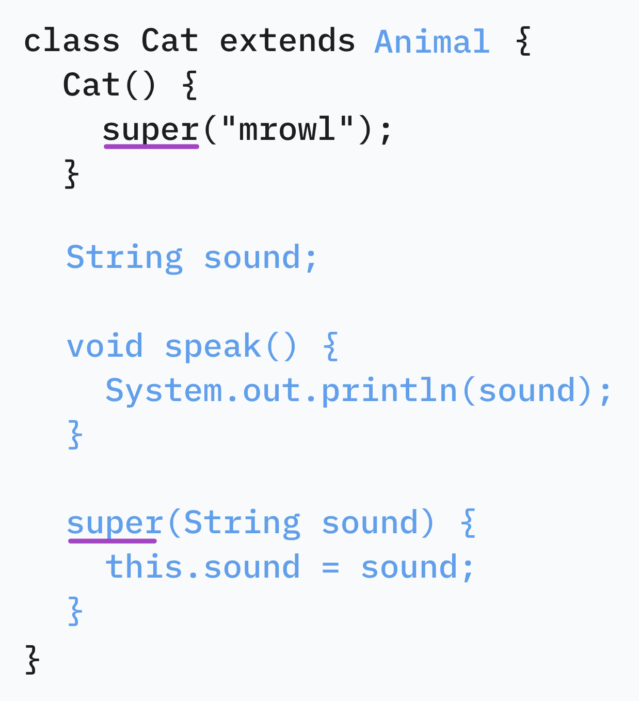
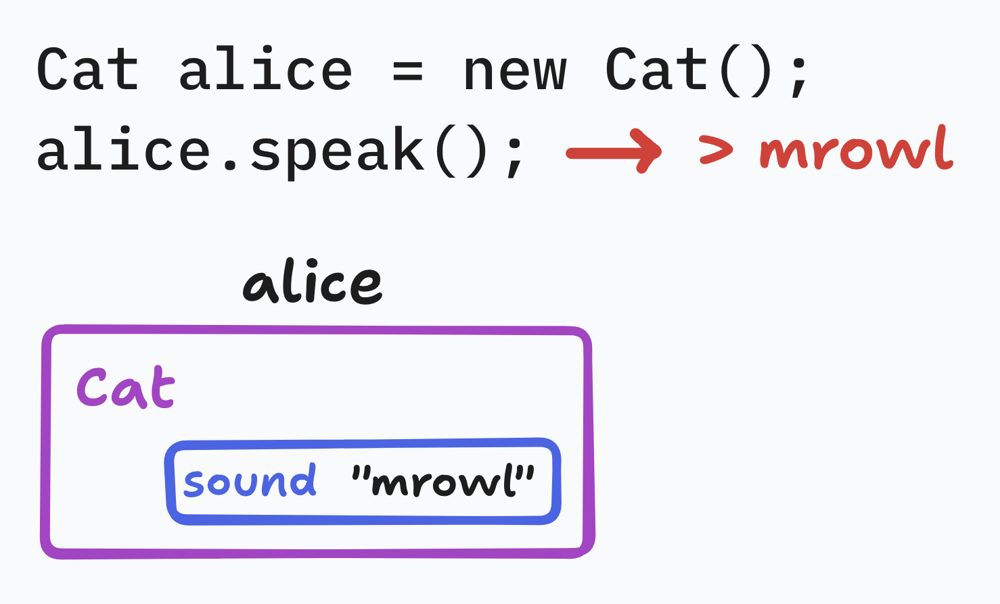
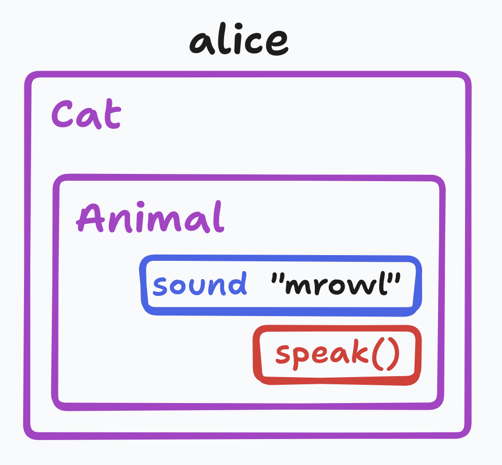
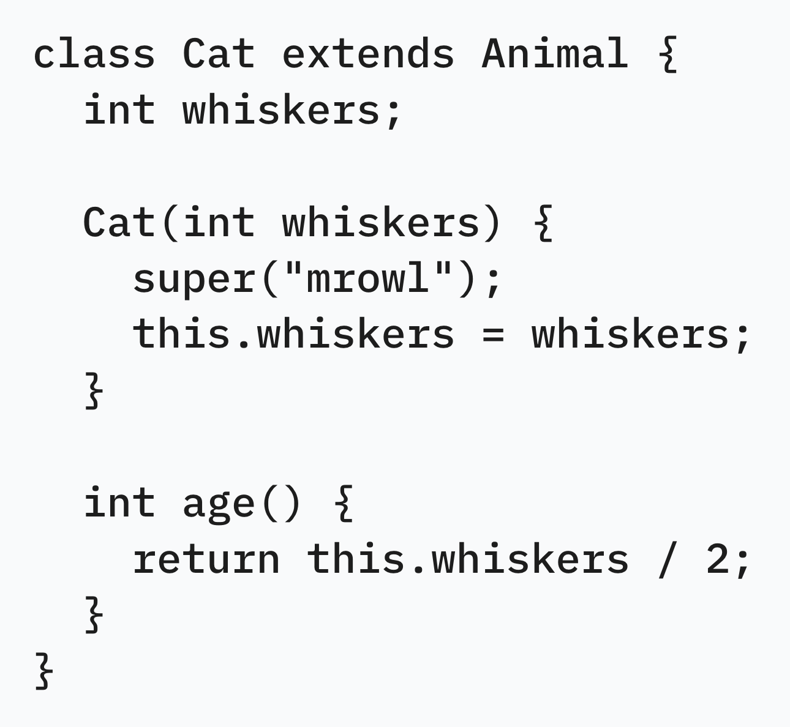
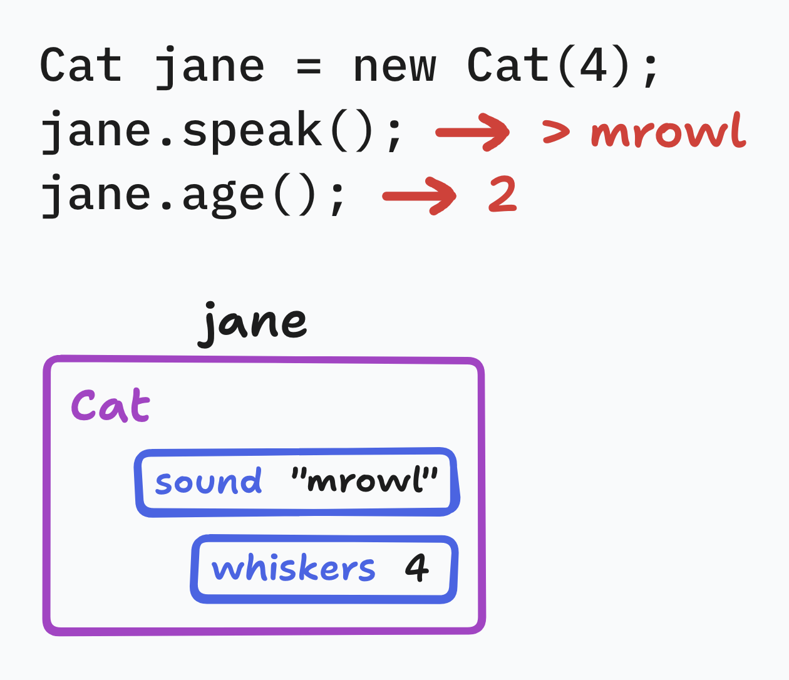
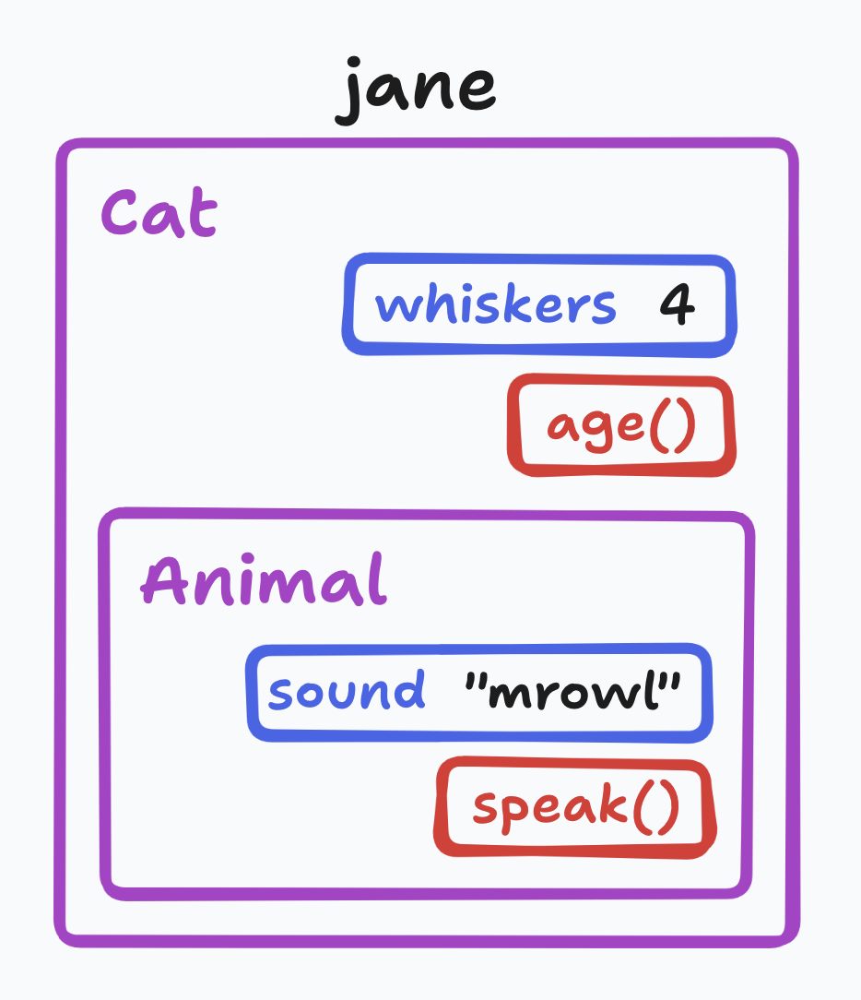

# subclasses

Subclasses model the inheritance of attributes.

---

Let's start with a base `Animal` class.

Like before, creating an instance.

---

We're going to make `Cat` extend the properties of `Animal`.

It can be thought of as copying over the variables and methods from `Animal`.
Notably, the `Animal` constructor gets renamed to `super`.
The cyan text doesn't actually exist in the code.

We can create an instance of this `Cat` class.
`speak` is available since it is inherited from `Animal`.

Note that every `Cat` is also an `Animal`.
They have the same properties and methods.

---

For a more complex example, let's also include an extra field and method in a new version of `Cat`.

We can now create this new `Cat`, giving it a whiskers count.
`speak` can be used based on the `Animal` superclass, and `age` was added for the `Cat` class.

Like before, every `Cat` is also an `Animal`.
This relationship is always true for subclasses.
However, in this case, it also includes some extra things like `whiskers` and `age`.

