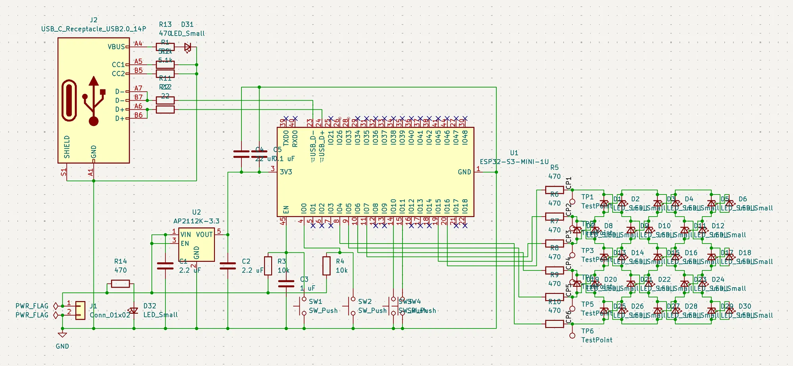
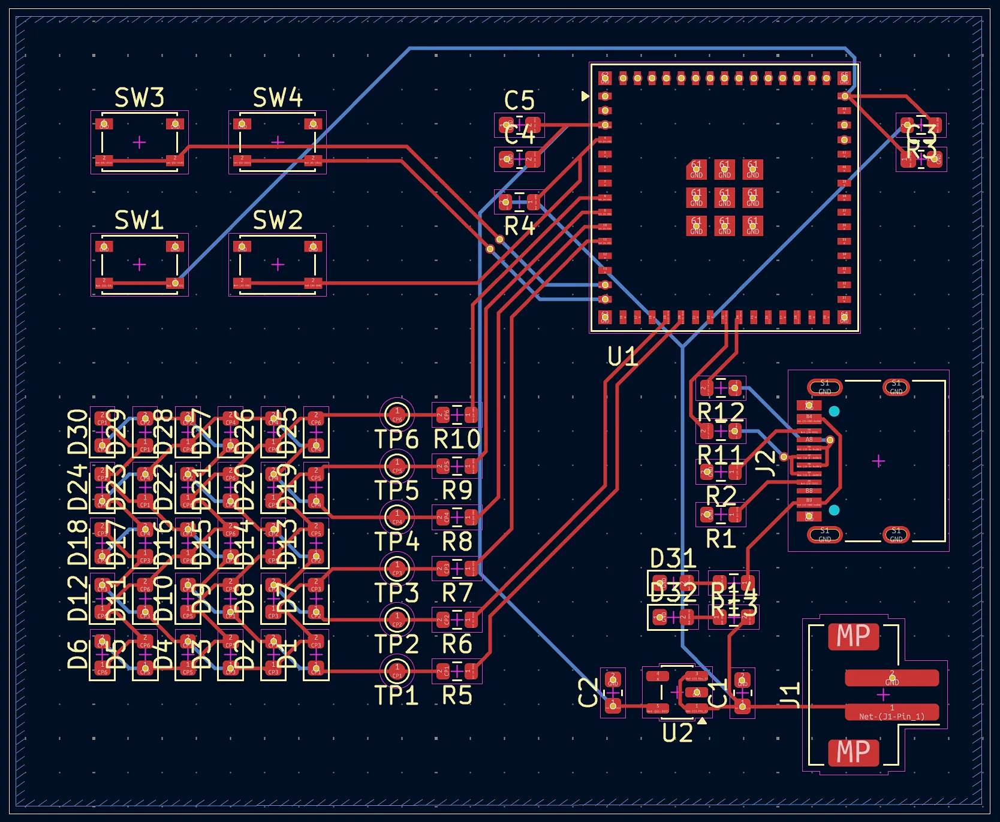

# Designed schematic and routed PCB

_5 hours_

I designed a schematic based on parts I researched: a Li-ion port for power, a USB-C port for flashing firmware, a charlieplexed 6x5 LED matrix, and an ESP32 and switches for controlling the LEDs.

I intend to miniaturize the board for the actual pendant, but since I have not worked with these specific components before, I wanted to design a larger test board to see if the concept works. Although it doesn't feature USB-C charging for the Li-ion, the rest of the board will remain the same (but with the matrix on one side and the rest of the components on the other side).

It took quite a bit of time to design the schematic because of the capacitors and resistors that were needed but only specified in datasheets of specific parts. I originally designed a schematic for the entire pendant, but this second streamlined revision is the one I have been describing.

For the PCB itself, I originally had a design that strongly mimicked the schematic, with the ESP32 and ports to the left side, and the LED matrix to the right. However, I found this layout to be cluttered and unclear for my prototype, so I ended up also redesigning the PCB to put the responsive inputs and outputs on one side and the necessities on the other sides.

Overall, I'm pretty happy with how the PCB came out and am excited to see if I can get it manufactured to see if my project will work!
