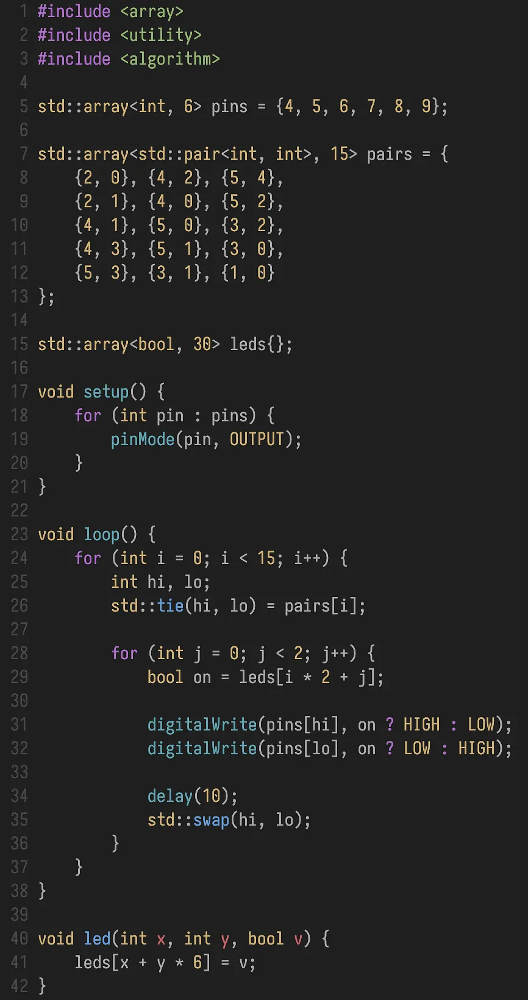

# Wrote firmware

_1.5 hours_

I wrote some firmware for the PCB I created in the previous journal.

Since then, I made a few small modifications. Most notable was changing some of the GPIO ports for the charlieplexed matrix, as it seemed like there was a contiguous range of safe pins that could be used on the ESP32-S3-MINI-1U. Additionally, I cleaned up some of the wiring and added some more test points that will aid in debugging the physical PCB.

For the firmware, since I'm using charlieplexing, the code is marginally more complicated than normal multiplexing. I set up a look-up table for matching LEDs to their respective pairs of low and high GPIOs and wrote a small loop for cycling through them and enabling the LEDs based on another array. I also wrote an additional test script for enabling a single LED, just to check if the matrix is working at all (though test points will also assist with this).

