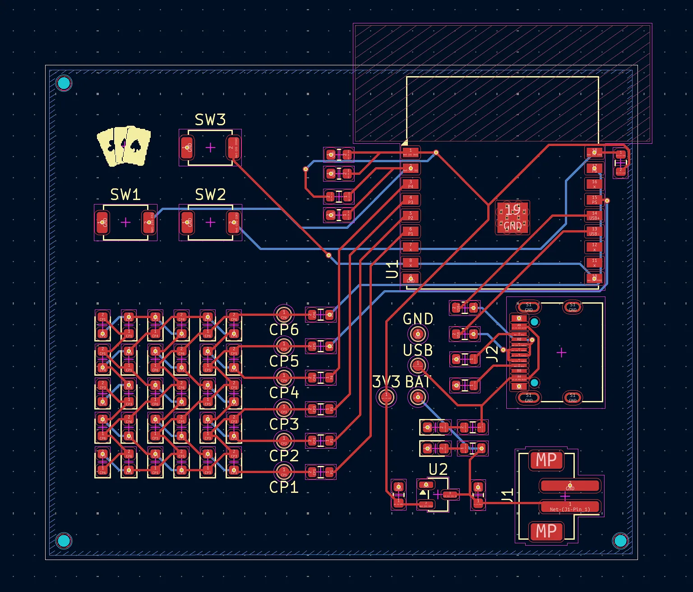

# Updated all the parts

_3 hours_

This was a pretty major update to the entire project, with the schematic, PCB, BOM, _and_ firmware being updated.

After uploading my PCB and BOM into JLCPCB, I found out that there are two different libraries of parts, with the former not including a $3 charge for each distinct part. Thus, I had to go through each of my components and swap them out for a Basic version. This wasn't too hard for resistors and capacitors and the like, but I did also have to swap out the buttons and VRM which required conforming to different schematics and footprints.

However, the larger change was also having my microcontroller (ESP32) being soldered through economic assembly, since the ESP32-S3-MINI-1U only supports standard PCBA. I decided to now use the ESP32-C3-WROOM-02, though the difference in GPIOs and size meant that I had to completely rewire my PCB to support it. Compared to the MINI-1U (which I later realized I was using incorrectly without an antenna), the WROOM-02 has a large keep-out zone that meant I had to move around components to fit it. Additionally, I only found 7 safe GPIO pins on the board instead of the >8 on the MINI-1U, meaning that I had to remove one button (since I need 6 pins for the LEDs). Also, since the GPIO pins were now different, the firmware also had to be updated to match the new layout.

I also added a silkscreen logo in place of the removed button!

