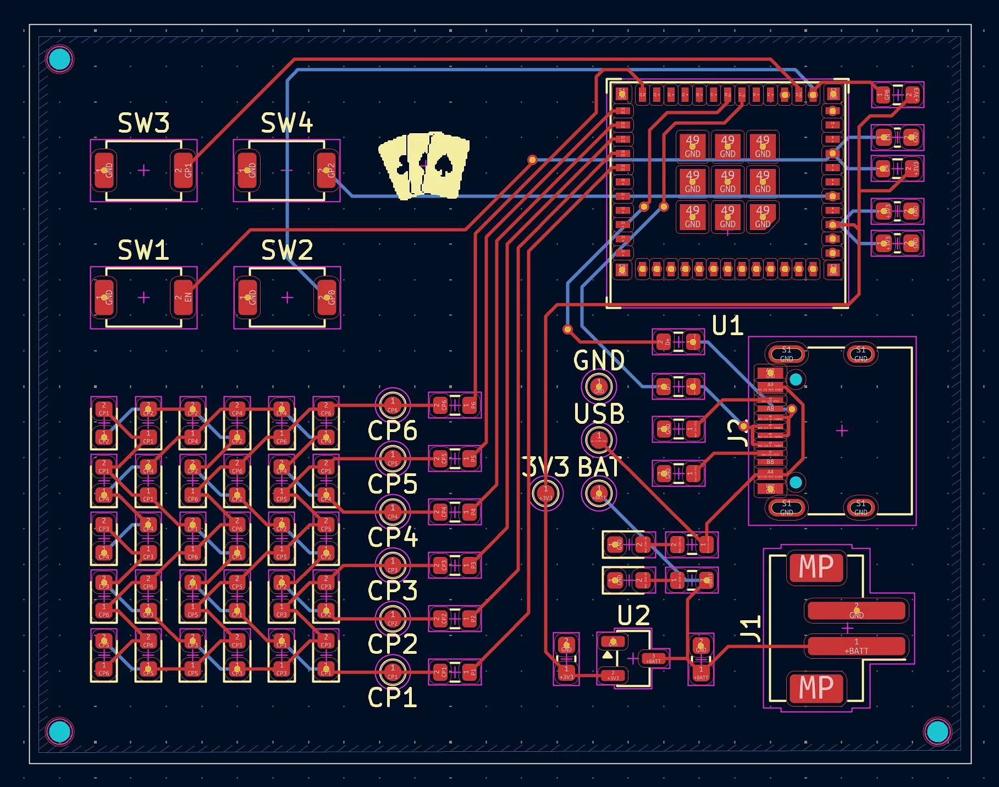

# Switched to C6-MINI

_1.5 hours_

After some more research, I found out that the ESP32 models lacking a builtin antenna (the U models) could be safely operated without connecting an external one, which I previously thought wasn't possible. Since I'm not intending to use any connectivity, this meant that I could use a much smaller chip that also didn't have to necessitate a keep-out zone.

I was heavily considering just moving to the ESP32-C3-WROOM-02U, which is just the antennaless version of the chip I already swapped to, the C3-WROOM-02. However, this chip is still pretty big as being part of the C3-WROOM lineup, and I found a different chip that I preferred—the ESP32-C6-MINI-1U.

My main requirements for the ESP32 model was to have builtin USB D-/D+ (for easier flashing) and to have a small footprint. Despite being smaller than the C3-WROOM, it contains _more_ GPIO pins, meaning that I was also able to add the second user button back to the board. Swapping the chip still required the same steps of redoing the schematic, PCB, BOM, and firmware, though it was quite a bit faster this time.

