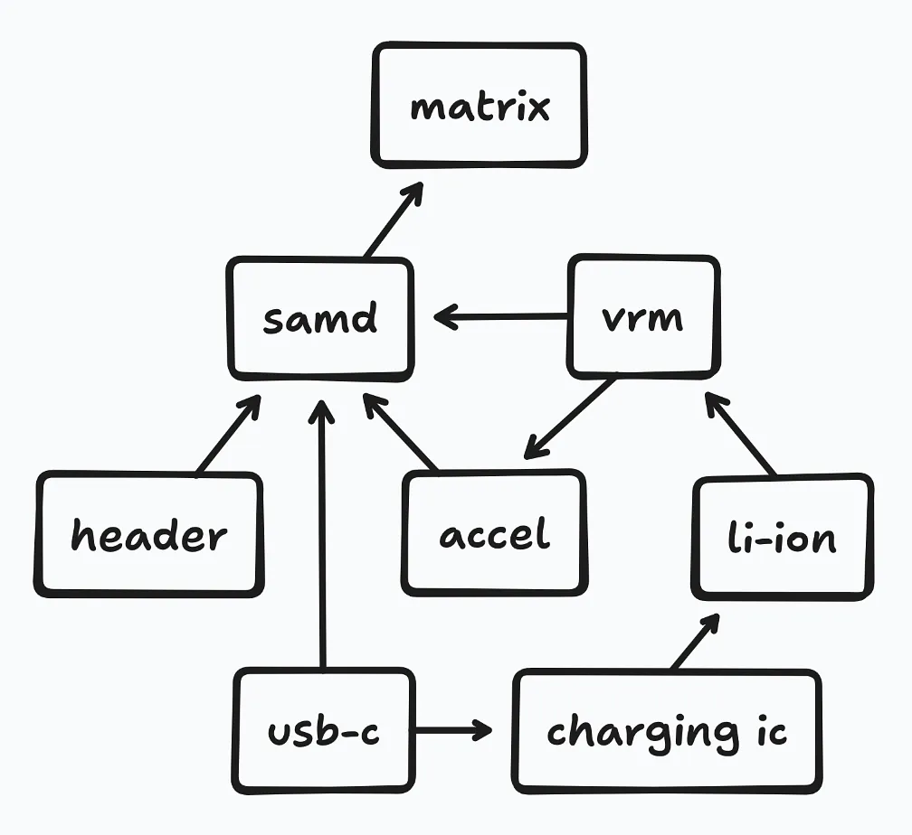
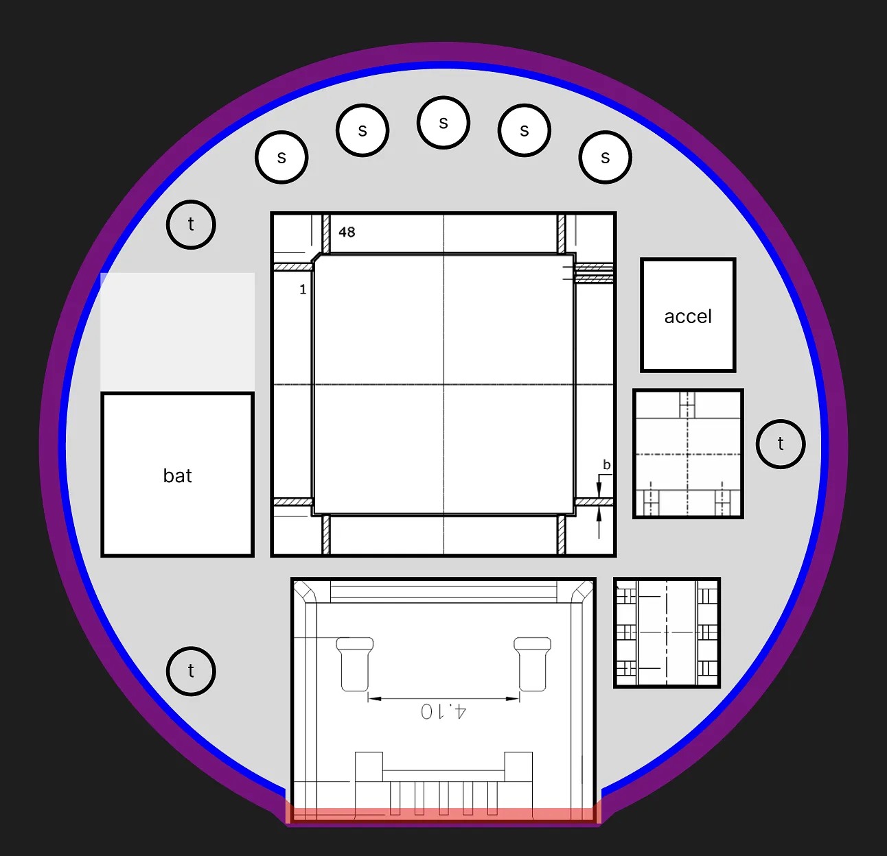
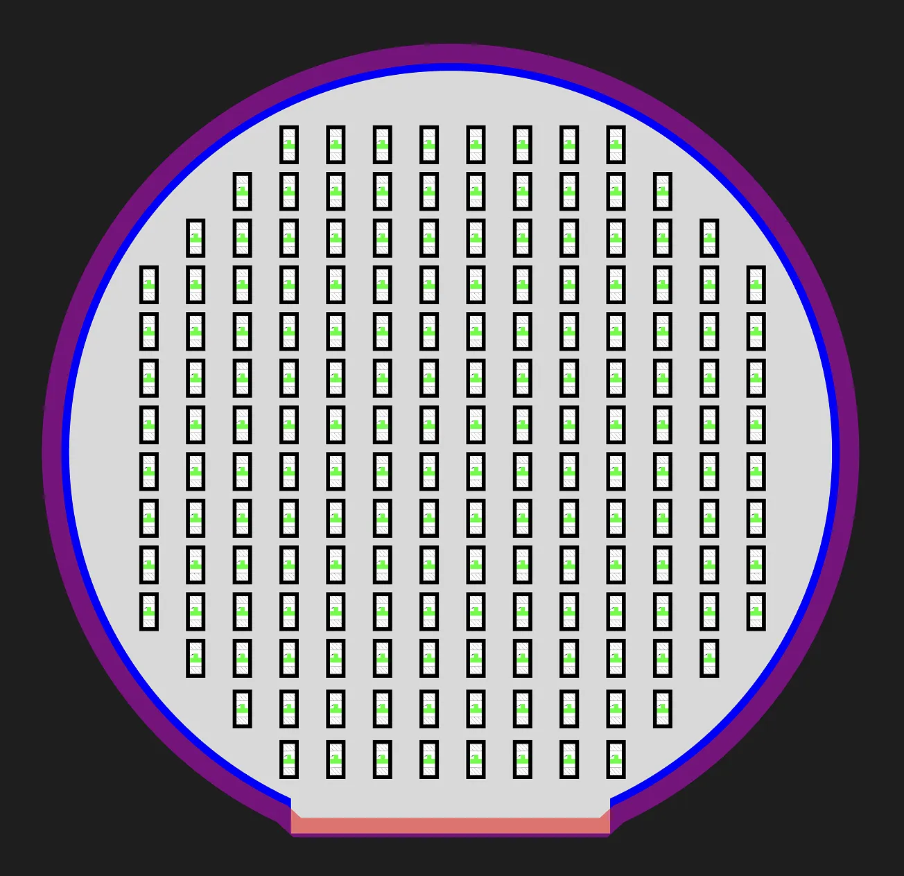

# Found and laid out parts

_5 hours_

I started out by making a small flow chart.

This helped with finding the parts I needed. Although I worked on a similar thing in my last project, a lot of the components had to change in order to accommodate the smaller size of the pendant...

* USB-C swapped for a smaller micro-USB connector
* JST connector swapped for smaller right-hand one
* LEDs swapped from the larger 0603 size to 0402s

...and the largest change, which was swapping from an ESP32-C6-MINI-1U to an ATSAMD21G18A-AU. This chip is a smaller and more power efficient (and also omits the networking capabilities of the ESP32 which I don't need), but is a little less ergonomic as it doesn't come with USB flashing enabled.

The main addition is an accelerometer, which I'm going to use for reading rotation, velocity, etc. Adding it is pretty easy, since the ATSAMD21 has pins that support I2C, so it's pretty much just one extra part. Another addition is a charging IC—since the pendant's battery has to be pretty small, and I don't want to have to swap out the battery when it gets depleted. I also had to figure out where I was going to add a SWD header for flashing the ATSAMD21, but found a good way to do it based on exposed pads that wires can be soldered to—allowing flashing—and then desoldered, which minimizes the amount of space required for this one-time operation.

After collecting the parts for each of the components: the micro-USB header, charging IC, battery connector, VRM, accelerometer, 0402 LEDs, and the microcontroller itself, I needed to figure out how to lay out all the parts. This project is very space-constrained, to make it look nice—but this also means that everything needs to be positioned precisely for it to work. While I could have just used KiCad for this, I thought of a different solution: getting the dimensions for the different parts and positioning everything in Figma with a 1mm:10px scale.

It took a lot of attempts to land on the final design. I actually initially started with making a grid out of 0603 LEDs—before I felt that they weren't dense enough for the project, and swapping to 0402s. I also originally thought of making the PCB a square with chopped off corners, but I realized that I could just make the PCB a circle in the first place, instead of just the case outside of it. After a while of positioning, fixing, and rethinking things, I landed on the design below.

Back:

Front:

As suggested by the layout, the PCB is going to have 4 layers, to accommodate having components on both sides. It's mostly a circular shape, but there needs to be a bit of a flat side on the bottom for the micro-USB port. And for this size—which is very small—it fits 172 LEDs, which should work out well!

Anyways, based on this, I'll now have to actually work on the schematic and PCB!
