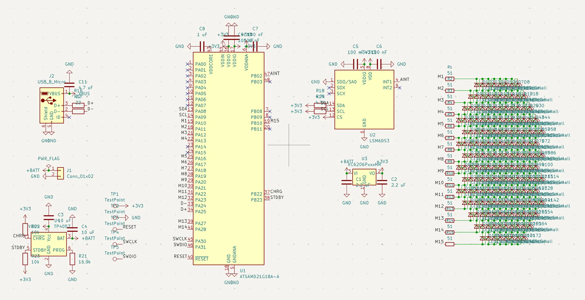
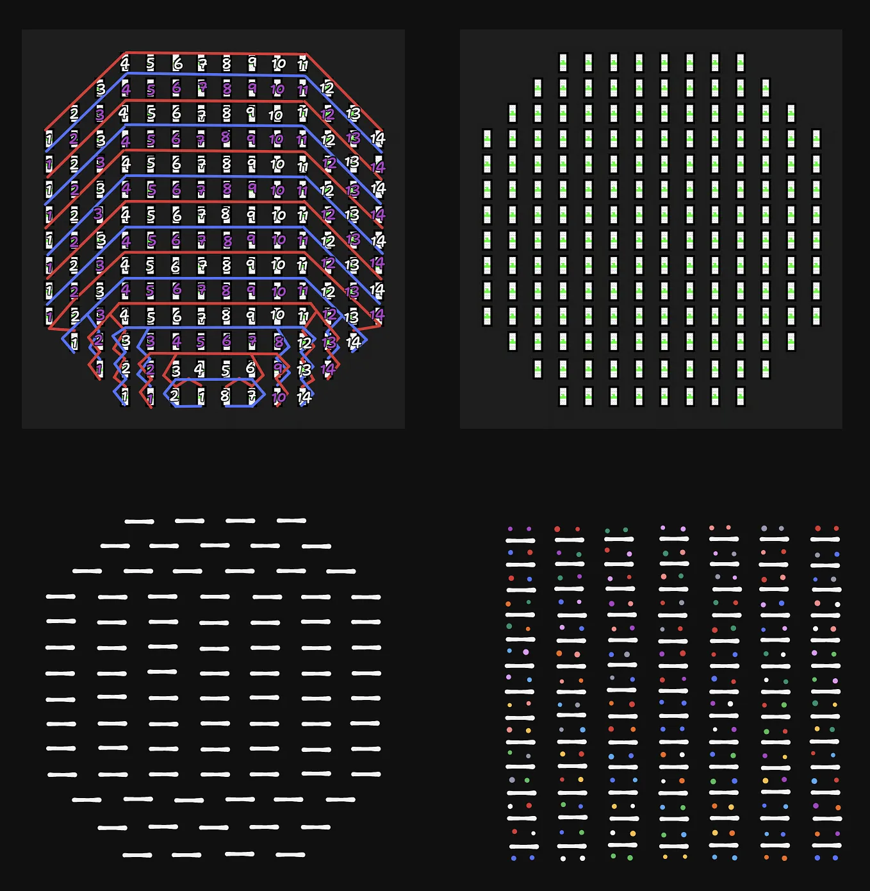
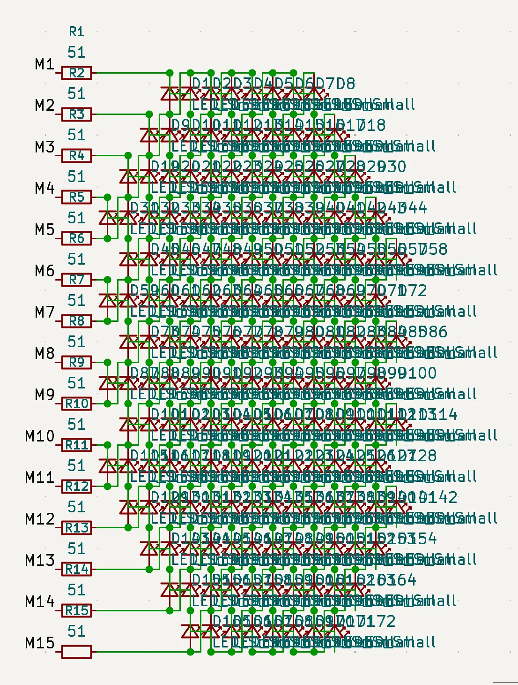

# Designed schematic

_7 hours_

I designed a schematic based on the parts I researched in the previous entry.

For most components, this just involved researching the different resistors and capacitors needed—but the charlieplexed matrix was a lot harder to figure out. I initially wanted to use 14 GPIO pins, since 172 LEDs means that 14(14 - 1) = 182 meets the required amount of LEDs (based on N(N - 1) with charlieplexing). However, I couldn't find a good design that made it easy to have this setup, since the circular grid of LEDs is 14x14 (with corners cut away to make the circle), which means that it couldn't fit within the 14x13 grid. I made these sketches as attempts at different layouts, but it ended up not working well:

I actually tried to put the last one into the schematic, but ended up giving up after a few connections since I realized a different solution: just using 15 GPIO pins and a proper 14x14 matrix. The ATSAMD21 chip I'm using has a lot of extra pins available and it wasn't like I needed more, so this idea worked well. I made another sketch:

And this is found implemented on the right side of the schematic:

