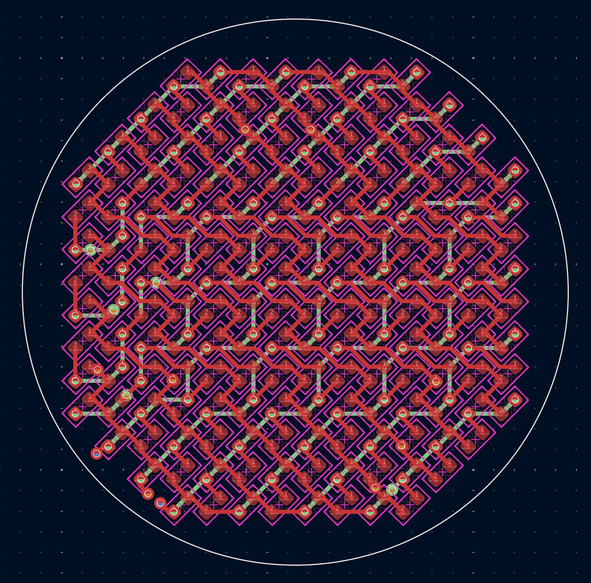
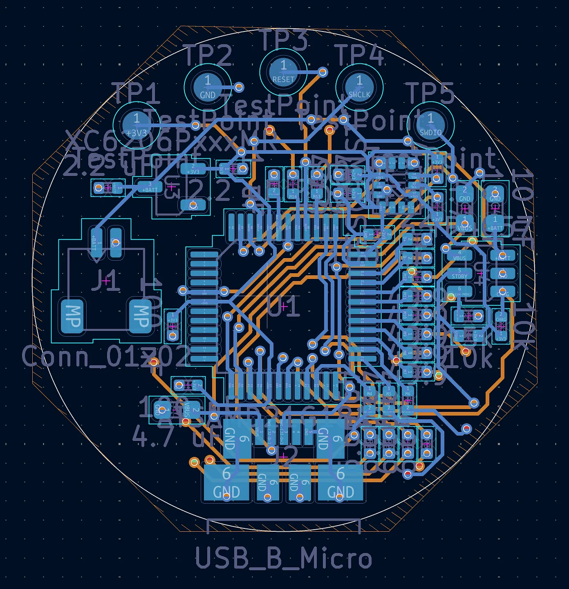
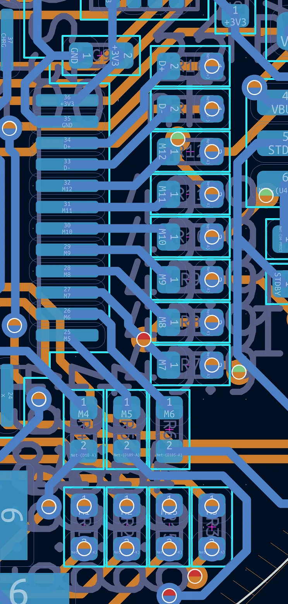
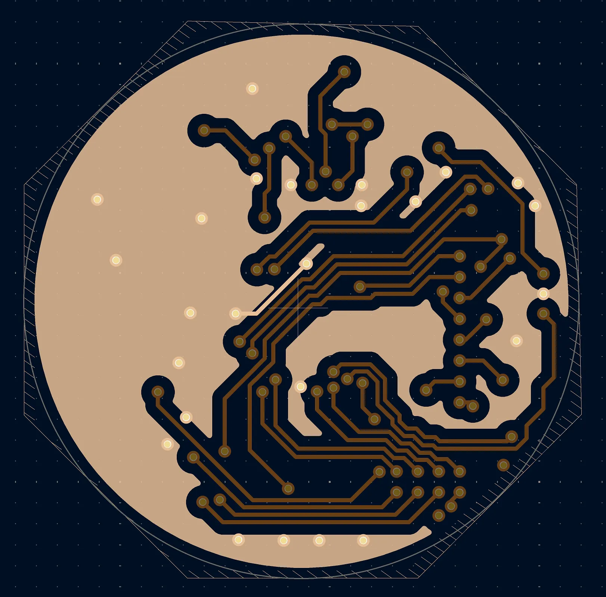
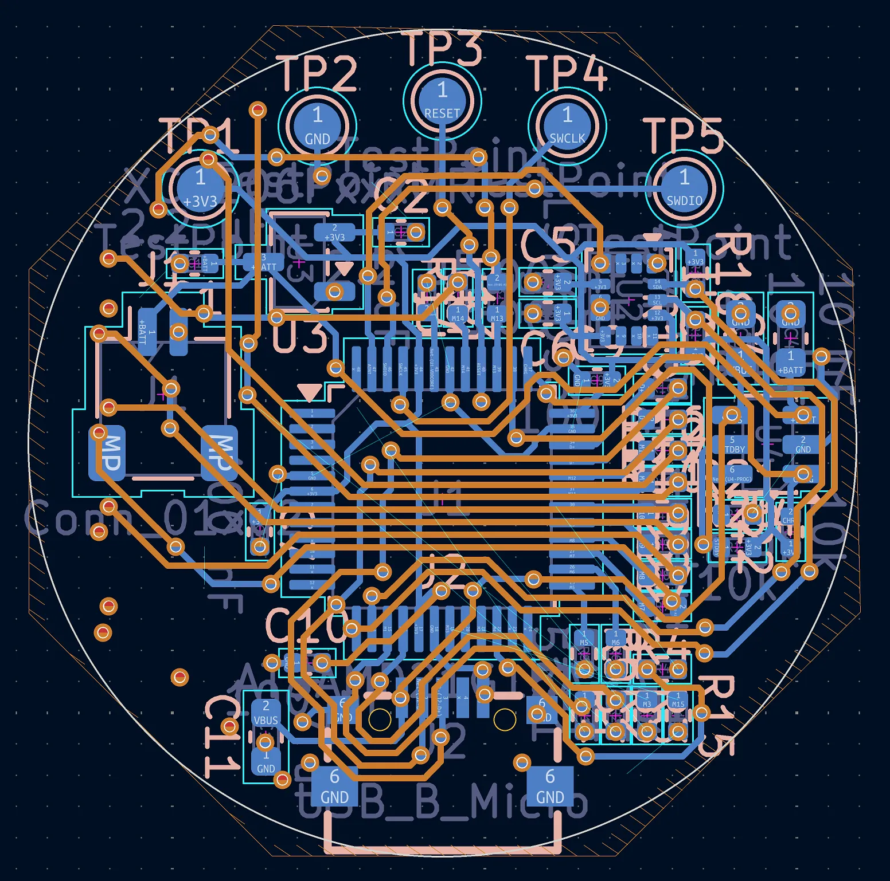
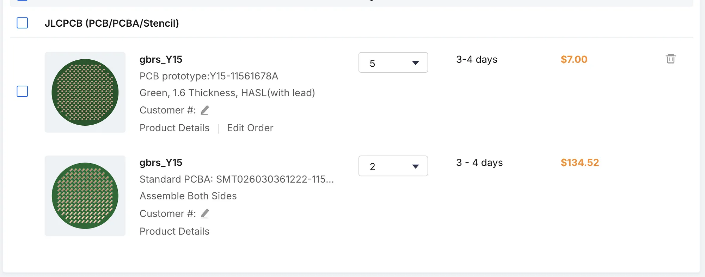

# Routed PCB

_10 hours_

I routed the PCB!

Front:

Back:

I first started with the LED matrix, which was actually not too hard given that I dealt with all the complexity when designing the schematic. The main difference is with the diagonal LEDs, which are arranged that way to minimize the vertical gap between the centers of the LEDs which was there in the old design. In terms of wiring, I just found a nice repeatable pattern for the F.Cu and In1.Cu layers, and connected each pair of LEDs in the same way.

The actual difficulty came with dealing with the other side of the PCB with the components, which is why the routing process took so long. When wiring, I had to manage three things: connecting components to other components, making sure the ground fill stayed connected, and leaving places for connecting to the LED lines on the top layers.

In terms of wiring outputs, there are the SWD pads from before:

And early on, I decided to cluster all of the GPIO resistors in an area to the right of the chip:

This helped, but it meant that there needed to be a lot of vias and In2.Cu wires near that area, which compromised the ground fill for a while. I was eventually able to move components around to create this ground fill which barely snakes through the other wires/vias that require it to be removed:

Managing these different constraints was already hard enough in this version, but I actually also had a previous version I tried to route, which was just not working, leading to me restarting the bottom layers from scratch; but this was the in-progress old version:

Additionally, I realized that the micro-USB connector I was planning to use required having holes through all layers, which didn't work because it would drill through LEDs, so I ended up swapping to a purely SMD connector. So, this version also incorporates that fix which ended up also making the connector easier to wire around (since there weren't holes that needed to be avoided).

However, I found another problem, now with this implementation. Since I'm using a four-layer format with components on both sides, I need to have both sides be PCBA'd, but JLC only allows for double-sided assembly in their "standard" PCBA service. This adds a _lot_ to the cost of the PCBs:

So, I think I'm going to split the PCB into two four-layer ones, which mount to each other through some in-between connector instead of just via'ing from the top to the bottom.
