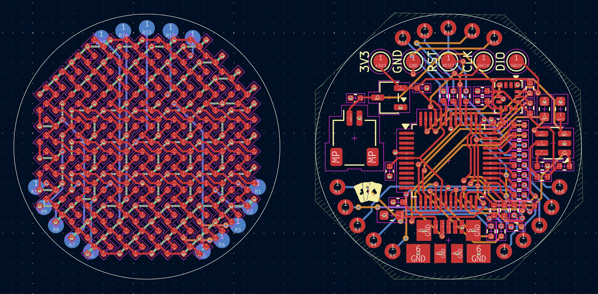
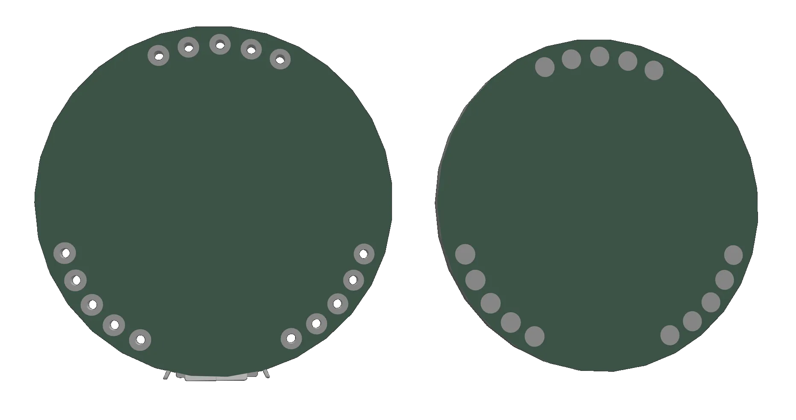

# Split PCB

_4 hours_

I split the PCB to use two separate boards which connect together, instead of the double-sided 4-layer stack-up that I was using before.

First, I had to undo a lot of the wiring I had done for the previous design, since the LEDs are no longer directly connected to the ATSAMD21 board. This ended up being pretty convenient, as I kept a 4-layer stack-up which meant that I could allocate a layer for GND on the components side, and add an extra layer for routing on the LEDs side. In terms of the connector itself, I first wanted to use an actual connector like the Molex SlimStack, which allows connecting two boards together with a mated height of ~0.6mm. This seemed really good, but I realized that I would have to hand-solder the connectors on (since avoiding double-sided PCBA is the whole point of the separate boards), which is relatively impossible given how small the pitch is on such a small connector.

However, I ended up finding a different solution: castellation. Since the boards are going to be right on top of each other, castellation would work well as solder would also adhere the boards together. The problem was actually something completely different: like with the double-sided PCBA, castellation adds a _lot_ to the total, and additionally requires standard assembly which leads to the same problem as before. So instead, I realized that one board could just use a standard through hole that's filled with solder to connect to pads below. It took a bit more effort to get the THTs to properly work since they have to be pushed a bit more into the middle of the board, but that's what I ended up doing which seems to work well.

