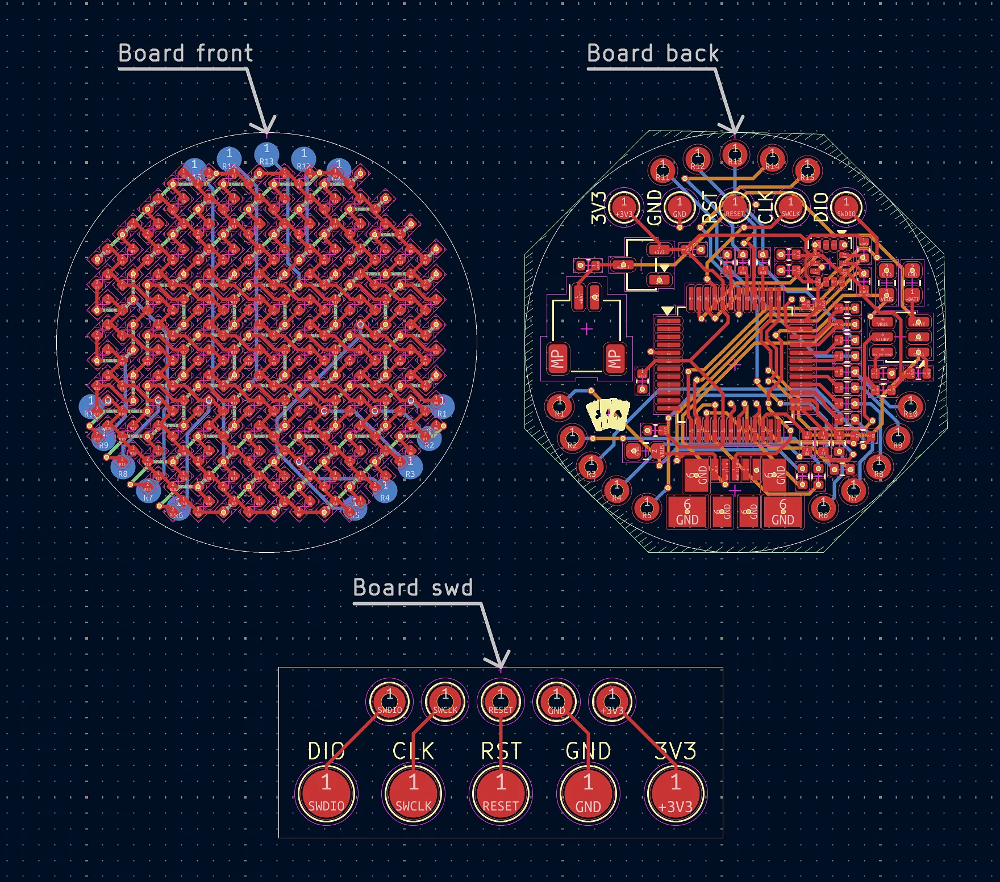

# Added PCB revisions

_2 hours_

Thanks to some notes by a reviewer, I learned of some problems with my PCB design that I had to take care of. The main one had to do with vias, which I learned previously can either be throughhole (all layers) or blind/buried (only some layers)—but JLCPCB apparently _only_ supports throughhole ones. So, I had to update my PCB to use them, which took quite a bit of time since I had to shift everything around to account for all the vias now connecting all the layers. However, I was also able to make the vias a bit smaller in the process which made it a little bit more convenient, since there was a little bit more space to work with. From the same review, I also learned of some problems with putting vias in pads, though that seems like something that'll need to be taken care of in the ordering process since the front really relies on consistent placement of components since there are a _lot_ of LEDs—so scattering the vias around would somewhat break that. I'm planning to use JLCPCB's POFV (plated over filled via) process to circumvent this, which should allow keeping the vias inside pads while not causing problems with solder.

